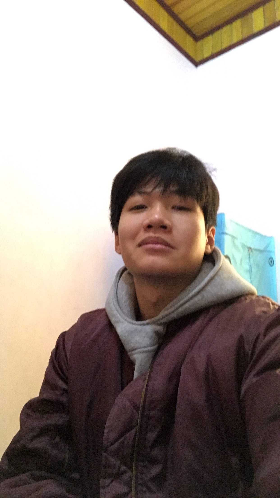

# sample-21080340
<!DOCTYPE html>
<html>

<head>
	<meta charset="utf-8">
	<title>Introduce Myself</title>
	<link rel="stylesheet" href="thuan.css">
	<link rel="preconnect" href="https://fonts.googleapis.com">
	<link rel="preconnect" href="https://fonts.gstatic.com" crossorigin>
	<link
		href="https://fonts.googleapis.com/css2?family=Lobster&family=Noto+Sans:wght@500&family=Noto+Serif:ital,wght@0,400;1,100&family=Pacifico&family=Roboto:wght@400;500&display=swap"
		rel="stylesheet">
	
	<link rel="icon" href="images/favicon.jpg" type="image/jpg" />
</head>

<body>
	
	<h3>Lê Quang Thuấn</h3>
	
Mình là Thuấn. Mình đang là sinh viên năm 2 của Trường Quản Trị và Kinh Doanh(HSB). Dưới đây là một vài thông tin
	về bản thân mình😗.
  
	

		<button class="button" onclick="window.open('tel:0947749699', '_blank');"><i
				class="fa-solid fa-phone fa-beat"></i> Gọi điện cho tôi</button> 
		<button class="button" onclick="window.open( 'https://www.facebook.com/thuanleacay/', '_blank');"><i
				class="fa-brands fa-facebook fa-beat"></i> Facebook</button> 
		<button class="button" onclick="window.open( 'https://www.instagram.com/thuanleacay/', '_blank');"><i
				class="fa-brands fa-instagram fa-beat"></i> Instagram</button> 
		<button class="button1"><i class="fa-solid fa-photo-film"></i> My photo gallery </button>
	
 
	

		
		
		
		
		
	
 
	

		<table>
			<tr>
				<th>#</th>
				<th>Món ăn yêu thích</th>
				<th>Môn thể thao yêu thích</th>
				<th>Bộ phim yêu thích</th>
				<th>Trò chơi yêu thích</th>
			</tr>
			<tr>
				<td>1</td>
				<td>Sườn xào chua ngọt</td>
				<td>Đạp xe</td>
				<td>Howl's Moving Castle</td>
				<td>HayDay</td>
				
			</tr>
			<tr>
				<td>2</td>
				<td>Thịt rang cháy cạnh</td>
				<td>Bơi lội </td>
				<td>Ponyo on the cliff by the sea </td>
				<td>League of Legends</td>
			</tr>
			<tr>
				<td>3</td>
				<td>Bún chả</td>
				<td>Tập Gym</td>
				<td>Doreamon - Chú mèo máy đến từ tương lai</td>
				<td>Valorant</td>
			</tr>
			<tr>
				<td>4</td>
				<td>Bánh quấn</td>
				<td>Chạy bộ</td>
				<td>Shin - Cậu bé bút chì</td>
				<td>Plants and Zombies</td>
			</tr>
		</table>
	
 
	
body {
    background-color: #ced5b6;
    padding: 45px 0;
    color: black;
    text-align: center;
  }
  
  .avatar {
    border-radius: 100px;
    width: 100px;
  }
  
  h3 {
    font-family: 'Roboto', sans-serif;
    margin: 10px 0 8px 0;
  }
  
  p {
    font-family: 'Roboto', sans-serif;
    width: 450px;
    text-align: center;
    display: inline-block;
  }
  
  .button {
    margin-bottom: 20px;
    background-color: white;
    border: 0;
    width: 300px;
    padding: 15px 0 15px 0;
    border-radius: 100px;
    font-family: 'Roboto', sans-serif;
    font-size: 15px;
    font-weight: bold;
    transition-duration: 1s;
    transition-property: color, background-color;
    box-shadow: 0px 11px 22px -9px #000000;
    cursor: pointer;
  }
  .button:hover {
    color: white;
    background-color: black;
  }
  .button1 {
    margin-bottom: 20px;
    background-color: white;
    border: 0;
    width: 300px;
    padding: 15px 0 15px 0;
    border-radius: 100px;
    font-family: 'Roboto', sans-serif;
    font-size: 15px;
    font-weight: bold;
    box-shadow: 0px 11px 22px -9px #000000;
    display: block;
    margin: 2px auto ;
  }
  .button2 {
    margin-bottom: 20px;
    background-color: white;
    border: 0;
    width: 70px;
    padding: 15px 0 15px 0;
    border-radius: 100px;
    font-family: 'Roboto', sans-serif;
    font-size: 15px;
    font-weight: bold;
    transition-duration: 1s;
    transition-property: color, background-color;
    box-shadow: 0px 11px 22px -9px #000000;
    cursor: pointer;
  }
.image-grid {
	box-sizing: border-box;
	padding: 15px;
	display: grid;
	grid-template-columns: repeat(4, 1fr);
	grid-auto-rows: 300px;
	gap: 15px;
  margin-bottom: 25px;
}
.image-grid>img {
	width: 100%;
	height: 100%;
	object-fit: cover;
}

.image-grid-col-2 {
	grid-column: span 2;
}

.image-grid-row-2 {
	grid-row: span 2;
}
.box{
  width: 250px;
  margin:0 10px;
  box-shadow: 0 0 20px 2px rgba(0, 0, 0, .1) ;
}
.box img{
  display: block;
  width: 100%;
  border-radius: 5px;
}
.box:hover{
  transform: scale(1.1);
  transition: .4s transform;
}
table{
  margin-left: auto;
  margin-right: auto;
  width: 70%; 
  border-collapse: collapse;
  border-spacing: 0;
 }
 td , th{
  padding: 15px 20px;
  text-align: center;
  border-radius: 10px;
 }
 th{
  background-color: #04AA6D;
  color: #fafafa;
  font-family: 'Open Sans',Sans-serif;
  font-weight: 200;

 }
 tr{
  width: 100%;
  background-color: #fafafa;
  font-family: 'Montserrat', Sans-serif;
 }
 tr:nth-child(even){
  background-color: #eeeeee;
 }
 td:hover{
  background-color: #c9c6c6;
 }
 @media screen and (max-width: 1024px) {
	.image-grid {
		grid-template-columns: repeat(2, 1fr);
	  grid-auto-rows: 200px;
	}
}
.vid{
  gap: 50px;
  justify-content: center;
}
.container{
  width: 80%;
  margin: 50px auto}
